# **Bmsit-Bookshare**
Bmsit Bookshare - A web Application for sharing of Books between Students of BMSIT College

<strong>Team Members:</strong> <a href="https://www.linkedin.com/in/roushan-agarwalla-bb0564222/">Roushan Agarwalla(Backend)</a>, <a href="https://www.linkedin.com/in/sahana-guttikar-913713227">Sahana Suresh Guttikar(FrontEnd)</a>, <a href="https://www.linkedin.com/in/tanmay-sharma-10b3a8227">Tanmay Sharma(FrontEnd)</a>, <a href="https://www.linkedin.com/in/sanskriti-agrawal-8a3714227">Sanskriti Agrawal(FrontEnd)</a>

<strong>Frameworks/Languages Used : </strong> HTML, CSS, Django(Python), Bootstrap.


## **How to Run**

* Clone the github repository by using the command
```shell
    git clone <REPOSITORY_URL>
```
* Move to the cloned repository by using
```shell
    cd <REPOSITORY_NAME>
```
* Install all the required python libraries by using
```shell
    pip install -r requirements.txt
```
* Run the Django app by using the command
```shell
    python manage.py runserver
```

* Now Visit the url localhost:8000/ in you browser

## **Screenshots**

* **HomePage**

  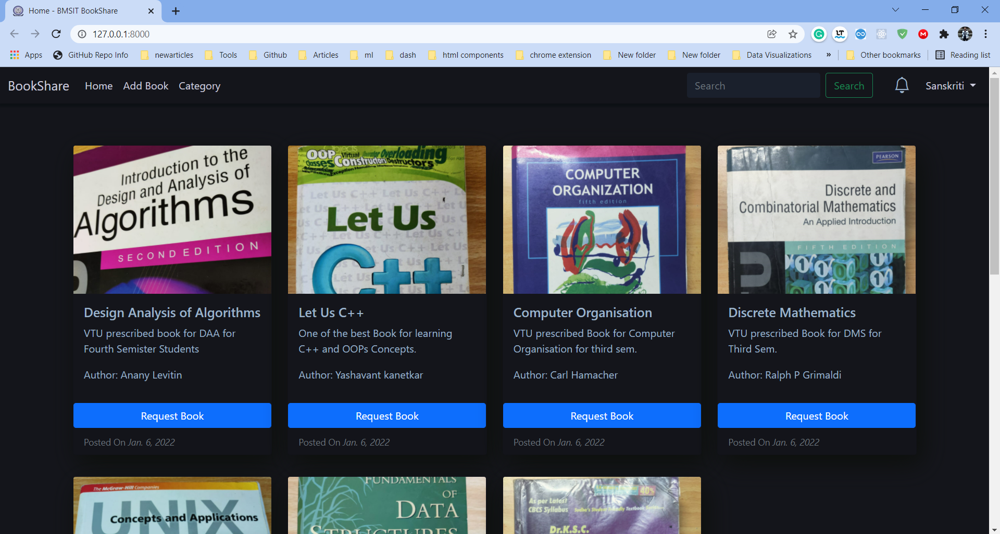

* **Categories Page**
  
  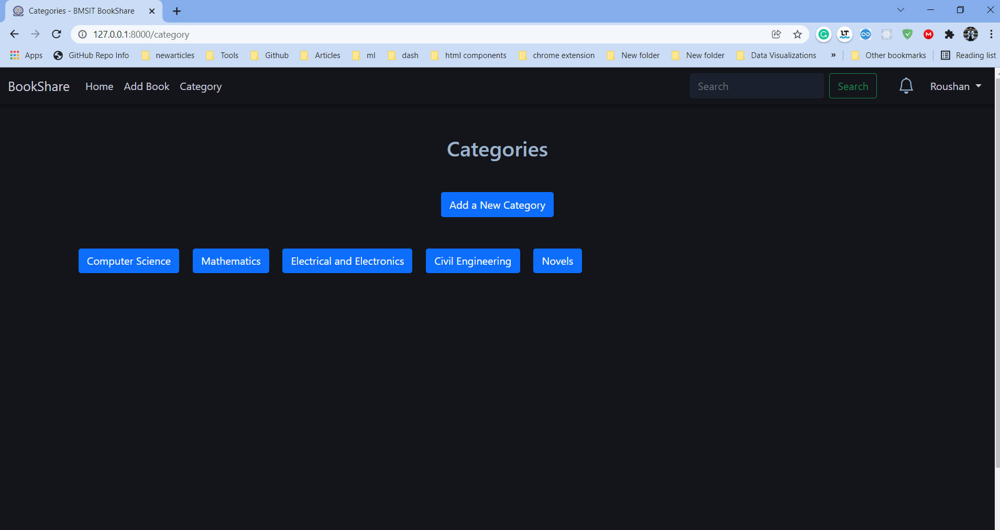

* **Books of category Maths**
  
  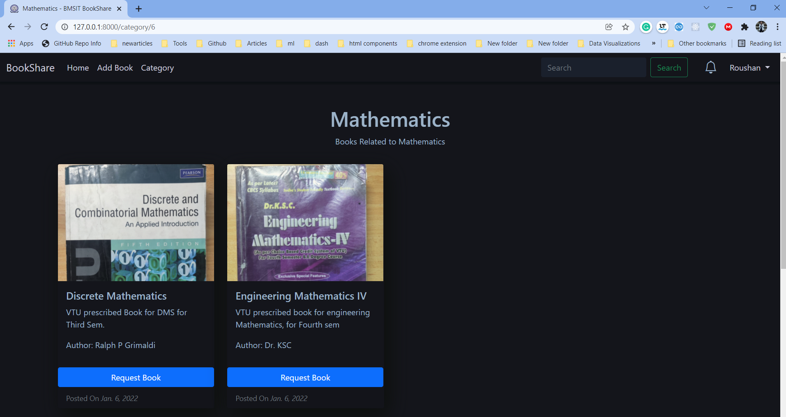

* **Adding Books**
  
  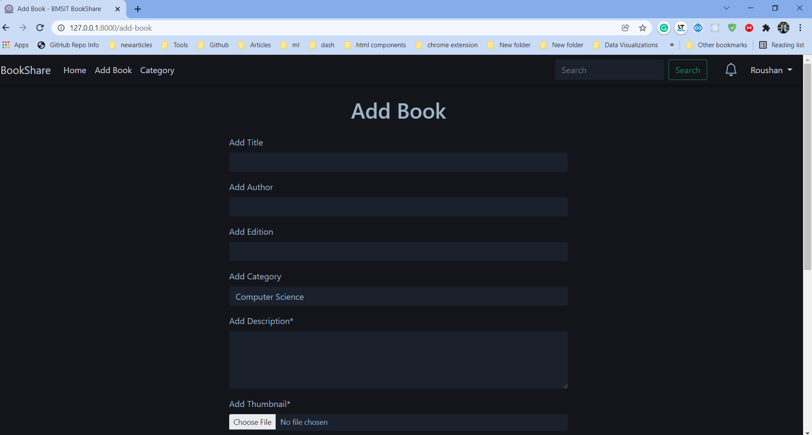

* **Books Uploaded by the current user**
  
  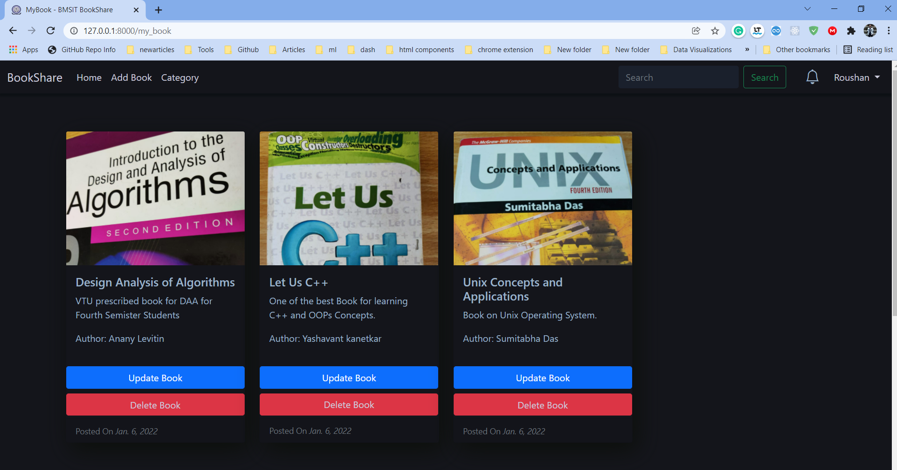

* **Searching for Books**
  
  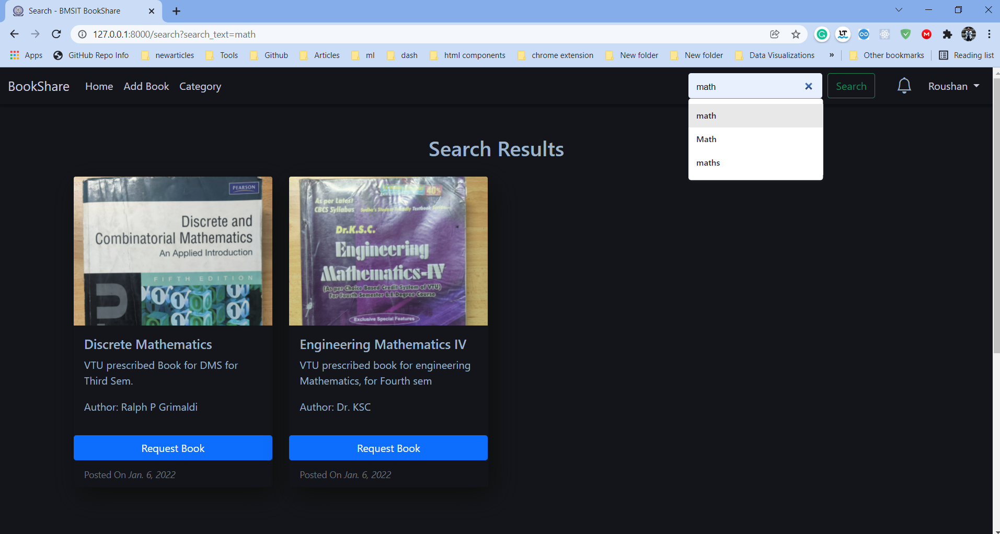

* **Sending Request for Book**
  
  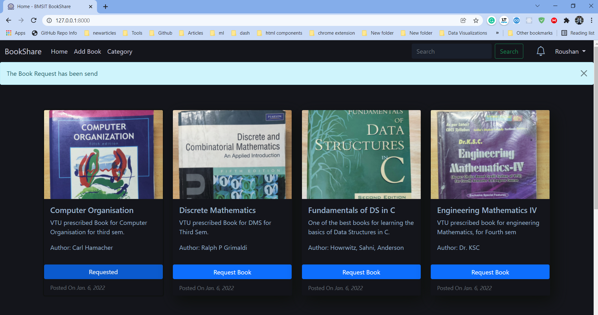

* **Accepting Or Rejecting the Book Request**
  
  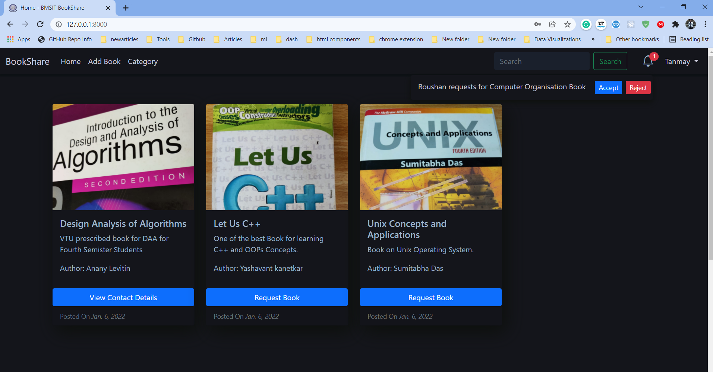

* **Can view contact details if the Request is accepted**
  
  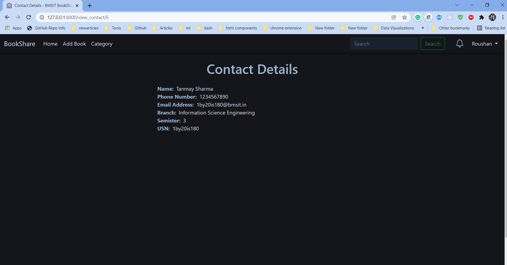

* **It is fully Responsive and Works well on Mobile Devices too**

  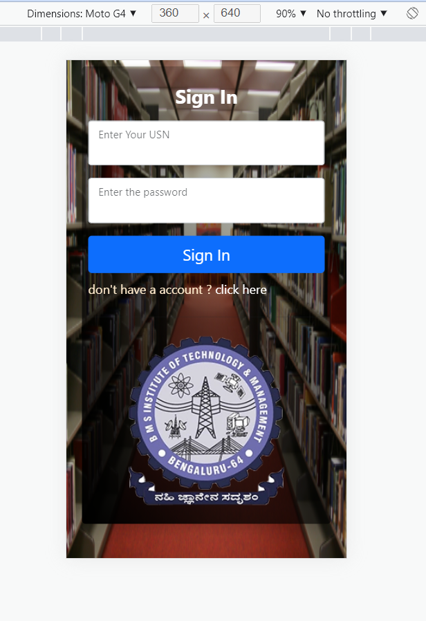
  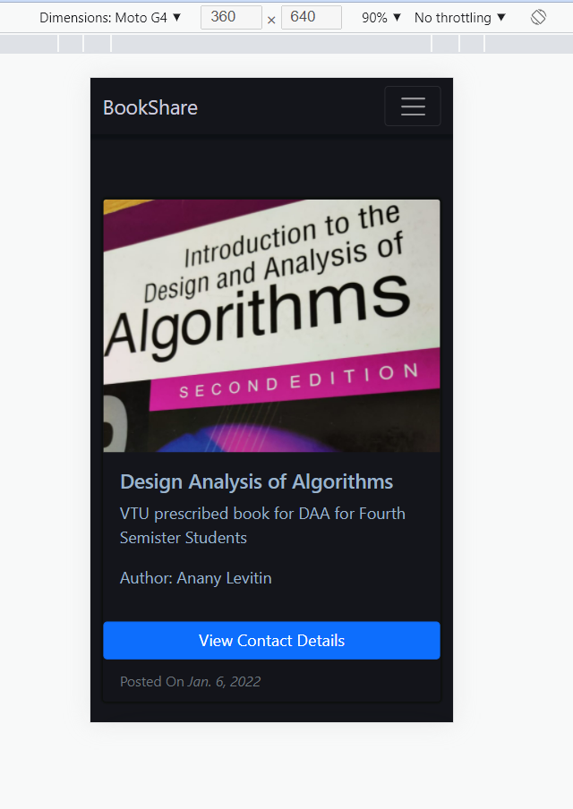
  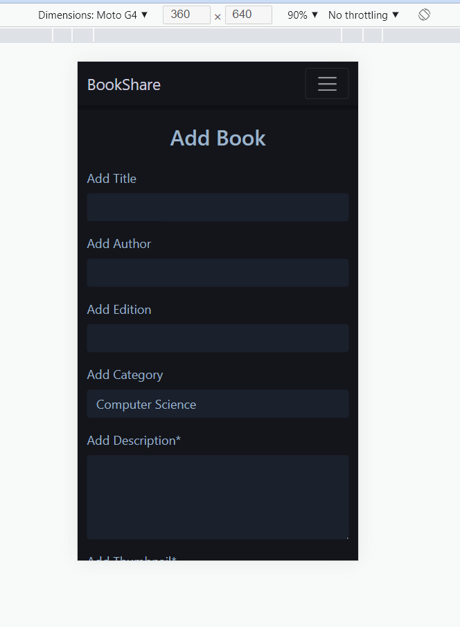